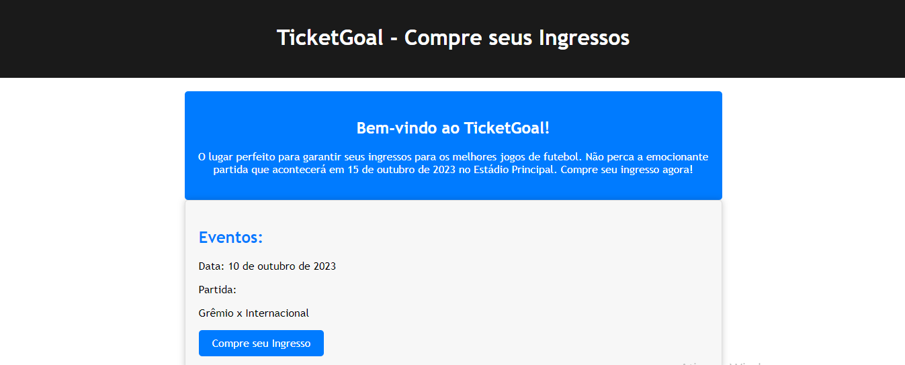

# TicketGoal - Sistema de Gerenciamento de Eventos

Bem-vindo ao TicketGoal, um sistema de gerenciamento de eventos que permite criar, configurar e vender ingressos para eventos esportivos e outros tipos de eventos em um estádio fictício.

```
Fiz esse projeto como uma forma de estudar e testar os meus conhecimentos, sei que ainda há muito o que melhorar.```

## Visão Geral

Este projeto tem como objetivo criar um sistema de gerenciamento de eventos com as seguintes funcionalidades:

- Cadastro e configuração de eventos.
- Venda de ingressos para eventos.
- Envio de emails privados.
- Aprovação de vendas com a API do MercadoPago.
- Monitoramento de vendas e faturamento.
- Reserva de assentos para eventos.



## Pré-requisitos

Antes de executar o projeto, certifique-se de ter instalado:

- [Node.js](https://nodejs.org/) e [npm](https://www.npmjs.com/) (ou [Yarn](https://yarnpkg.com/)) para executar o servidor.
- Um navegador da web moderno para acessar o sistema.

## Configuração do Projeto

1. Clone este repositório em sua máquina local:
```
git clone https://github.com/Guigsx/TicketGoal.gitt
```

2. Navegue até o diretório do projeto:
```
cd ticket-goal
```

3. Instale as dependências do projeto:
```
npm install
```

4. Inicie o servidor
```
npm start
```

5. Acesse o sistema em seu navegador em http://localhost:2000.

## Uso

### Fazer login como administrador

Para entrar na seção de administrador, siga estas etapas:

1. Vá para a rota admin/login ou qualquer outra rota admin.
2. Digite o PIN definido. (Por padrão é o PIN: 1234)
3. Clique no botão de "Login" e pronto!

### Criar um Novo Evento

Para criar um novo evento, siga estas etapas:

1. Faça login na sua conta de administrador.
2. Vá para a página admin.
3. Clique no botão "Criar Evento" e responda o formulário.
4. Clique em "Salvar" para criar o evento.

### Configurar a Capacidade do Estádio

Para configurar a capacidade do estádio, siga estas etapas:

1. Faça login na sua conta de administrador.
2. Vá para a página admin.
3. Clique no botão "Configurar Capacidade" e responda o formulário.
4. Clique em "Salvar" para editar a capacidade do estádio.

### Monitorar Vendas e Faturamento

Para monitorar as vendas e o faturamento do evento, siga estas etapas:

1. Faça login na sua conta de administrador.
2. Vá para a seção "admin".
3. Visualize o painel de controle.

Aproveite todas as funcionalidades do TicketGoal para gerenciar seus eventos de forma eficiente!